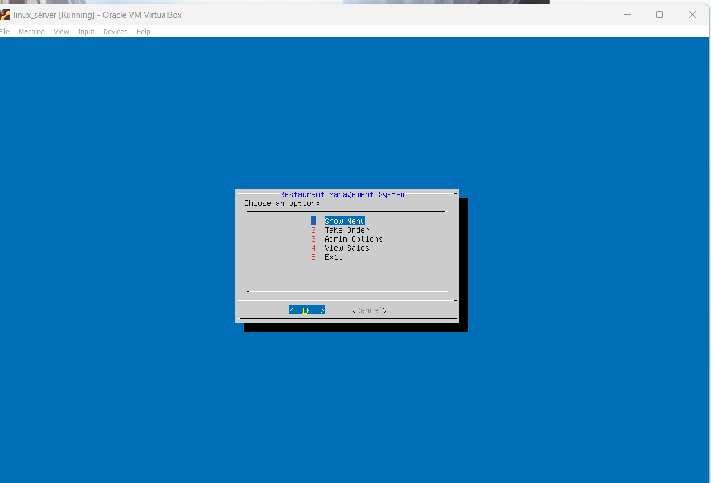

🍴 Restaurant Management System (Linux Shell Scripting + Dialog Box)

📜 Project Description

This is a beginner-friendly Restaurant Management System created using Shell Scripting and Dialog boxes on a Linux/Ubuntu environment.
It allows you to place orders, view the bill, and exit — all with beautiful interactive dialogs.


🛠️ Requirements

-> Linux-based OS (Ubuntu, Kali, etc.)

-> dialog package installed
## Installation

Install my-project as

```bash
  1) sudo apt-get install dialog

  2) cd restaurant_project

  3) chmod +x *.sh

  4)./restaurant.sh


```

    
## Screenshots



